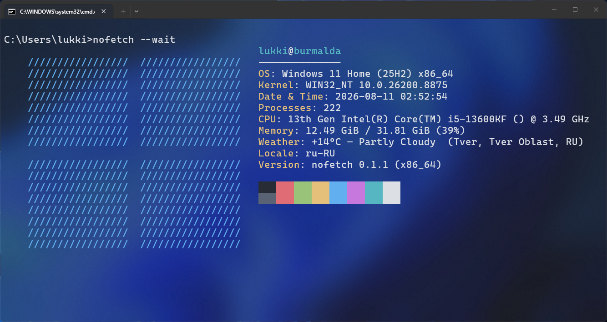
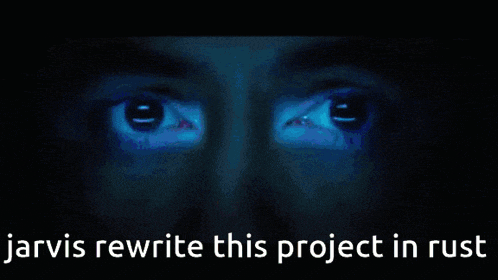

# Nofetch

[![GitHub license](https://img.shields.io/github/license/fastfetch-cli/fastfetch?logo=data:image/svg%2bxml;base64,PD94bWwgdmVyc2lvbj0iMS4wIiBlbmNvZGluZz0idXRmLTgiPz48c3ZnIHdpZHRoPSI4MDBweCIgaGVpZ2h0PSI4MDBweCIgdmlld0JveD0iMCAwIDI0IDI0IiBmaWxsPSJub25lIiB4bWxucz0iaHR0cDovL3d3dy53My5vcmcvMjAwMC9zdmciPjxwYXRoIG9wYWNpdHk9IjAuMSIgZD0iTTEyIDE3SDdDNS44OTU0MyAxNyA1IDE2LjEwNDYgNSAxNVY1QzUgMy44OTU0MyA1Ljg5NTQzIDMgNyAzSDE2QzE3LjEwNDYgMyAxOCAzLjg5NTQzIDE4IDVWMTlDMTggMjAuMTA0NiAxNy4xMDQ2IDIxIDE2IDIxQzE0Ljg5NTQgMjEgMTQgMjAuMTA0NiAxNCAxOUMxNCAxNy44OTU0IDEzLjEwNDYgMTcgMTIgMTdaIiBmaWxsPSIjZmZmZmZmIi8+PHBhdGggZD0iTTE5IDNIOVYzQzcuMTE0MzggMyA2LjE3MTU3IDMgNS41ODU3OSAzLjU4NTc5QzUgNC4xNzE1NyA1IDUuMTE0MzggNSA3VjEwLjVWMTciIHN0cm9rZT0iI2ZmZmZmZiIgc3Ryb2tlLXdpZHRoPSIyIiBzdHJva2UtbGluZWNhcD0icm91bmQiIHN0cm9rZS1saW5lam9pbj0icm91bmQiLz48cGF0aCBkPSJNMTQgMTdWMTlDMTQgMjAuMTA0NiAxNC44OTU0IDIxIDE2IDIxVjIxQzE3LjEwNDYgMjEgMTggMjAuMTA0NiAxOCAxOVY5VjQuNUMxOCAzLjY3MTU3IDE4LjY3MTYgMyAxOS41IDNWM0MyMC4zMjg0IDMgMjEgMy42NzE1NyAyMSA0LjVWNC41QzIxIDUuMzI4NDMgMjAuMzI4NCA2IDE5LjUgNkgxOC41IiBzdHJva2U9IiNmZmZmZmYiIHN0cm9rZS13aWR0aD0iMiIgc3Ryb2tlLWxpbmVjYXA9InJvdW5kIiBzdHJva2UtbGluZWpvaW49InJvdW5kIi8+PHBhdGggZD0iTTE2IDIxSDVDMy44OTU0MyAyMSAzIDIwLjEwNDYgMyAxOVYxOUMzIDE3Ljg5NTQgMy44OTU0MyAxNyA1IDE3SDE0IiBzdHJva2U9IiNmZmZmZmYiIHN0cm9rZS13aWR0aD0iMiIgc3Ryb2tlLWxpbmVjYXA9InJvdW5kIiBzdHJva2UtbGluZWpvaW49InJvdW5kIi8+PHBhdGggZD0iTTkgN0gxNCIgc3Ryb2tlPSIjZmZmZmZmIiBzdHJva2Utd2lkdGg9IjIiIHN0cm9rZS1saW5lY2FwPSJyb3VuZCIgc3Ryb2tlLWxpbmVqb2luPSJyb3VuZCIvPjxwYXRoIGQ9Ik05IDExSDE0IiBzdHJva2U9IiNmZmZmZmYiIHN0cm9rZS13aWR0aD0iMiIgc3Ryb2tlLWxpbmVjYXA9InJvdW5kIiBzdHJva2UtbGluZWpvaW49InJvdW5kIi8+PC9zdmc+)](https://github.com/maslina524/nofetch/blob/main/LICENSE)

  
[![No std](https://img.shields.io/badge/Built_with-%23!%5Bno__std%5D-blue?logo=data:image/svg%2bxml;base64,PD94bWwgdmVyc2lvbj0iMS4wIiBlbmNvZGluZz0idXRmLTgiPz48IS0tIFVwbG9hZGVkIHRvOiBTVkcgUmVwbywgd3d3LnN2Z3JlcG8uY29tLCBHZW5lcmF0b3I6IFNWRyBSZXBvIE1peGVyIFRvb2xzIC0tPgo8c3ZnIGZpbGw9IiNmZmZmZmYiIHdpZHRoPSI4MDBweCIgaGVpZ2h0PSI4MDBweCIgdmlld0JveD0iMCAwIDI0IDI0IiB4bWxucz0iaHR0cDovL3d3dy53My5vcmcvMjAwMC9zdmciPjxwYXRoIGQ9Ik0xNC4yNSw4SDkuNzVBMS43NTIsMS43NTIsMCwwLDAsOCw5Ljc1djQuNUExLjc1MiwxLjc1MiwwLDAsMCw5Ljc1LDE2aDQuNUExLjc1MiwxLjc1MiwwLDAsMCwxNiwxNC4yNVY5Ljc1QTEuNzUyLDEuNzUyLDAsMCwwLDE0LjI1LDhaTTE0LDE0SDEwVjEwaDRabTgtNWExLDEsMCwwLDAsMC0ySDIwVjYuNzVBMi43NTIsMi43NTIsMCwwLDAsMTcuMjUsNEgxN1YyYTEsMSwwLDAsMC0yLDBWNEgxM1YyYTEsMSwwLDAsMC0yLDBWNEg5VjJBMSwxLDAsMCwwLDcsMlY0SDYuNzVBMi43NTIsMi43NTIsMCwwLDAsNCw2Ljc1VjdIMkExLDEsMCwwLDAsMiw5SDR2MkgyYTEsMSwwLDAsMCwwLDJINHYySDJhMSwxLDAsMCwwLDAsMkg0di4yNUEyLjc1MiwyLjc1MiwwLDAsMCw2Ljc1LDIwSDd2MmExLDEsMCwwLDAsMiwwVjIwaDJ2MmExLDEsMCwwLDAsMiwwVjIwaDJ2MmExLDEsMCwwLDAsMiwwVjIwaC4yNUEyLjc1MiwyLjc1MiwwLDAsMCwyMCwxNy4yNVYxN2gyYTEsMSwwLDAsMCwwLTJIMjBWMTNoMmExLDEsMCwwLDAsMC0ySDIwVjlabS00LDguMjVhLjc1MS43NTEsMCwwLDEtLjc1Ljc1SDYuNzVBLjc1MS43NTEsMCwwLDEsNiwxNy4yNVY2Ljc1QS43NTEuNzUxLDAsMCwxLDYuNzUsNmgxMC41YS43NTEuNzUxLDAsMCwxLC43NS43NVoiLz48L3N2Zz4=)](https://github.com/maslina524/nofetch/blob/main/src/main.rs)

**Nofetch** is a neofetch-like tool for beautiful system information display with flexible output customization, written entirely in Rust with the `#![no_std]` attribute and no dependencies except the standard `alloc`. Fully compatible with [fastfetch](https://github.com/fastfetch-cli/fastfetch)

## About the project

The project is created based on and with full compatibility with [fastfetch](https://github.com/fastfetch-cli/fastfetch) for experimentation and improving the original project.

Fully written in pure Rust with the `!#[no_std]` attribute and no third-party dependencies. Created in accordance with [clippy](https://github.com/rust-lang/rust-clippy) lints.

Currently being developed only for Windows, with Linux support planned for the future.

